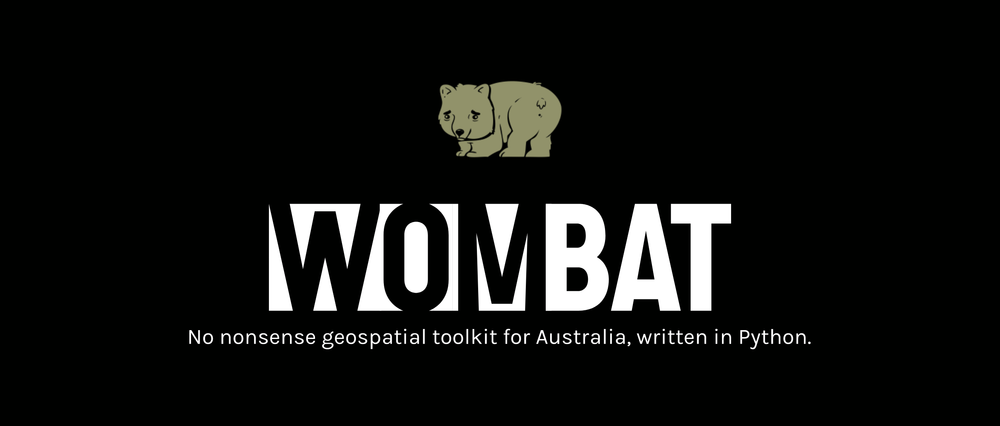

[](https://travis-ci.com/bgriffen/wombat)
[](https://opensource.org/licenses/MIT)

Wombat is a Python toolkit designed help answer geospatial related questions about Australian cities & regions. A simple to use set of functionalities enable the querying of of a large number of open-source datasets *simultaneously*. These datasets range from aerial imagery, building morphology, census information (e.g. demographics), points of interest, elevation, flooding, education, property sale history and transport networks. The goal of wombat is to make it a good means to an ends, such that data products can be easily fed into other downstream geospatial analyses and visualisations.


 ## ⛏️ Motivation

 Many geospatial projects are leviathans in their deployment with high interdependent systems and datasets that are quickly supersceded. As a result, these house-of-cards systems often have a lifespan of 1-2 years then become archived, either owing to funding priority changes or simply developer migration to other interests. In an ever growing avalanche of public data, we need more open source tools to better understand the world we live in and where we are going. Wombat is being developed in aid of achieving more, with less. 

 **Disclaimer:** The developer has no prior geospatial experience and so your mileage may vary. This project is a "learn by doing" exercise and very much a *work in progress*. 
 
 Lastly, this builds of the shoulders of many other works[^1][^2][^3][^4][^5].

## 📖 Table of Contents

- [Features](#features)
- [Datasets](#datasets)
- [Installation](#installation)
- [Usage](#usage)
- [Contributing](#contributing)
- [License](#license)
- [Contact](#contact)

## 📐 Features

- [x] Purpose built for Australian cities, incorporating government, open and post-processed datasets.
- [x] Built for data scientists, interested in building urban models (rather than overlays^N).
- [x] Interactive visualisations using [leafmap](https://leafmap.org/) (ipyleaflet, folium backends)
- [x] Powered by Python with direct access to [GeoPandas](https://geopandas.org/en/stable/) dataframes for your custom analyses.
- [x] Standardized post-processed datasets for local and rapid processing, including
    * [x] Combined [OSM + Microsoft building footprints](/building), including LiDAR height data
    * [x] Historical property sale history for major cities (1M+ properties)
    * [x] Points of interest combining OSM + Overture datasets
    * [x] Instant [30m resolution Digital Elevation Models](/elevation) (+viewsheds)
    * [x] [ACARA](https://www.acara.edu.au/) school performance metrics and overlays
    * [x] Socioeconomic ([SEIFA](https://www.abs.gov.au/websitedbs/censushome.nsf/home/seifa)) indices for different regions
    * [x] [Pandana](https://github.com/UDST/pandana)+[UrbanAccess](https://udst.github.io/urbanaccess/index.html) transportation network analytics
    * [x] [OSMX](https://osmnx.readthedocs.io/en/stable/) walkability analytics
    * [x] [Urbanity](https://github.com/winstonyym/urbanity) urban analytics
- [ ] Coming datasets:
    * [ ] Flooding data    
    * [ ] Noise data    
    * [ ] Heritage data
    * [ ] Green space assortivity indices
    * [ ] CENSUS data
- [ ] Coming tools:
    * [ ] Machine learning property price prediction model    
    * [ ] Livible cities benchmarks e.g. [Higgs et al. 2023](https://www.nature.com/articles/s41597-023-02013-5)

## Datasets

wombat draws on a number of off-the-shelf datasets as well as post-processed datasets. Nearly all datasets of siginificant size are stored locally. In some cases, datsets are streamed from various online sources but only where the bandwidth requirements are modest (e.g. population tile data). The data sources can be broken down into broadly three categories, Government, Public, post-processed.

| Dataset  | Goverment | Open | Brisbane | Sydney | Melbourne | Perth | Adelaide | Hobart | Canberra | Darwin |
| :--- | :--- | :--- | :--- | :--- | :--- | :--- | :--- | :--- | :--- | :--- |
| Addresses |  | [G-NAF](https://geoscape.com.au/data/g-naf/) | :white_check_mark: | :white_check_mark: | :white_check_mark: | :white_check_mark: | :white_check_mark: | :white_check_mark: | :white_check_mark: | :white_check_mark: |
| Elevation | [GeoScience Australia](https://www.ga.gov.au/scientific-topics/national-location-information/topographic-maps-data/topographic-maps), [ELVIS](https://elevation.fsdf.org.au/) | [TessaDSM](https://tessadem.com), [FABDEM](https://research-information.bris.ac.uk/en/datasets/fabdem-v1-2) | :white_check_mark: | :white_check_mark: | :white_check_mark: | :white_check_mark: | :white_check_mark: | :white_check_mark: | :white_check_mark: | :white_check_mark: |
| Education | [ACARA](https://acara.edu.au/contact-us/acara-data-access) | | :white_check_mark: | :white_check_mark: | :white_check_mark: | :white_check_mark: | :white_check_mark: | :white_check_mark: | :white_check_mark: | :white_check_mark: |
| Population | [ABS](https://maps.abs.gov.au/) | [Meta HDX](https://dataforgood.facebook.com/dfg/docs/high-resolution-population-density-maps-demographic-estimates-documentation#how-to-access-data) | :white_check_mark: | :white_check_mark: | :white_check_mark: | :white_check_mark: | :white_check_mark: | :white_check_mark: | :white_check_mark: | :white_check_mark: |
| Buildings |  | [Overture](https://overturemaps.org/), [OSM Buildings](https://osmbuildings.org/), [Microsoft](https://github.com/microsoft/GlobalMLBuildingFootprints) | :white_check_mark: | :white_check_mark: | :white_check_mark: | :white_check_mark: | :white_check_mark: | :white_check_mark: | :white_check_mark: | :white_check_mark: |
| POIs | | [Overture](https://overturemaps.org/), [OSM POIs](https://openpoimap.org/) | :white_check_mark: | :white_check_mark: | :white_check_mark: | :white_check_mark: | :white_check_mark: | :white_check_mark: | :white_check_mark: | :white_check_mark: |
| Transport | |  [GTFS](https://gtfs.org/) | :white_check_mark: | :alarm_clock: | :alarm_clock: | :alarm_clock: | :alarm_clock: | :alarm_clock: | :alarm_clock: | :alarm_clock: |
| Noise | |  [GTFS](https://www.data.brisbane.qld.gov.au/data/dataset/city-plan-2014-transport-noise-corridor-overlay) | :white_check_mark: | :alarm_clock: | :alarm_clock: | :alarm_clock: | :alarm_clock: | :alarm_clock: | :alarm_clock: | :alarm_clock: |

## 💻 Installation

Install `wombat` via pip:

```bash
pip install wombat-python (coming soon)
```

Or clone the repository and install manually:

```bash
git clone https://github.com/bgriffen/wombat.git
cd wombat
python setup.py install
```

## 🎹 Usage

Here's a quick example to get you started:

```python
import wombat

# initialise
w = wombat.Wombat(dataset_path=os.environ['WOMBAT_DATASET_PATH'])
w.set_city("Brisbane")
# more coming soon...
```

## License

wombat is distributed under the [MIT License](https://github.com/bgriffen/wombat/blob/main/LICENSE).

## Contact

Feel free to reach out with questions or suggestions:

- GitHub Issues: [https://github.com/bgriffen/wombat/issues](https://github.com/bgriffen/wombat/issues)
- Contact: [@brendangriffen](http://www.twitter.com/brendangriffen)


[^1]: Higgs C, Alderton A, Rozek J, Adlakha D, Badland H, Boeing G, Both A, Cerin E, Chandrabose M, Gruyter CD, Gunn L, Livera AD, Hinckson E, Liu S, Mavoa S, Sallis J, Simons K, Giles-Corti B. Policy-Relevant Spatial Inidicators of Urban Liveability And Sustainability: Scaling From Local to Global. Urban Policy and Research. 2022 2022/12//;40(4). en. doi:10.1080/08111146.2022.2076215.

[^2]: Alderton A, Higgs C, Davern M, Butterworth I, Correia J, Nitvimol K, Badland H. Measuring and monitoring liveability in a low-to-middle income country: a proof-of-concept for Bangkok, Thailand and lessons from an international partnership. Cities & Health. 2020 2020/09/07/;5(3):320-328. doi:10.1080/23748834.2020.1813537.

[^3]: Liu S, Higgs C, Arundel J, Boeing G, Cerdera N, Moctezuma D, Cerin E, Adlakha D, Lowe M, Giles-Corti B. A Generalized Framework for Measuring Pedestrian Accessibility around the World Using Open Data. Geographical Analysis. 2021. en. doi:10.1111/gean.12290.

[^4]: Boeing G, Higgs C, Liu S, Giles-Corti B, Sallis JF, Cerin E, Lowe M, Adlakha D, Hinckson E, Moudon AV, Salvo D, Adams MA, Barrozo LV, Bozovic T, Delclòs-Alió X, Dygrýn J, Ferguson S, Gebel K, Ho TP, Lai P-C, Martori JC, Nitvimol K, Queralt A, Roberts JD, Sambo GH, Schipperijn J, Vale D, Van de Weghe N, Vich G, Arundel J. Using open data and open-source software to develop spatial indicators of urban design and transport features for achieving healthy and sustainable cities. The Lancet Global Health. 2022 2022/06//;10(6):e907-e918. en. doi:10.1016/S2214-109X(22)00072-9.

[^5]: Yap, W., Stouffs, R. & Biljecki, F. Urbanity: automated modelling and analysis of multidimensional networks in cities. npj Urban Sustain 3, 45 (2023). doi.org/10.1038/s42949-023-00125-w
