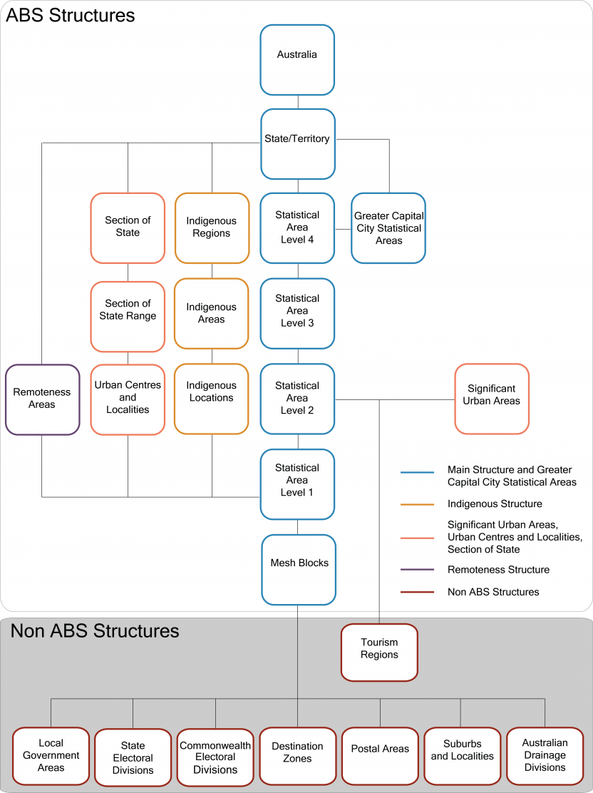

# Statistical Areas

When working with Australian regions, there is a well defined standards set by the Australian Statistical Geography Standard. It is broadly based on the concep of a "functional area". These functional areas are defined as the area which people commut or travel to access services. These can range from rural towns and it's hinterland, a regional city, an urban commercial zone or a major city. 

In `wombat`, these areas are handled by `wombat.Boundary` and interact with various government datasets pertaining to this hierarchy. 

Much of the following is detailed at the [Australian Bureau of Statistics](https://www.abs.gov.au/statistics/standards/australian-statistical-geography-standard-asgs-edition-3/latest-release#overview). We highlight here the main points relevant to understanding their handling in `wombat`.

## ABS Defined Areas

!!! note

    The following section is lifted from the [ABS website](https://www.abs.gov.au/statistics/standards/australian-statistical-geography-standard-asgs-edition-3/latest-release#overview) and reproduced here for convenience. 


The Main Structure is developed by the ABS and is used to release and analyse a broad range of social, demographic and economic statistics. It is a nested hierarchy of geographies, and each level directly aggregates to the next level, these are as follows:

* Mesh Blocks (MBs) are the smallest geographic areas defined by the ABS and form the building blocks for the larger regions of the ASGS. Most Mesh Blocks contain 30 to 60 dwellings.
* Statistical Areas Level 1 (SA1s) are designed to maximise the geographic detail available for Census of Population and Housing data while maintaining confidentiality. Most SA1s have a population of between 200 to 800 people.
* Statistical Areas Level 2 (SA2s) are medium-sized general purpose areas built to represent communities that interact together socially and economically. Most SA2s have a population range of 3,000 to 25,000 people.
* Statistical Areas Level 3 (SA3s) are designed for the output of regional data and most have populations between 30,000 and 130,000 people.
* Statistical Areas Level 4 (SA4s) are designed for the output of a variety of regional data, and represent labour markets and the functional area of Australian capital cities. Most SA4s have a population of over 100,000 people.
* States and Territories (S/T) are a cartographic representation of legally designated state and territory boundaries.
* Australia (AUS) is the largest region in the ASGS and represents the geographic extent of Australia.

### Indigenous Structure

* The Indigenous Structure enables the publication and analysis of statistics for the Aboriginal and Torres Strait Islander population of Australia.
* Indigenous Locations (ILOCs) represent small Aboriginal and Torres Strait Islander communities (urban and rural) with a minimum population of about 90 people.
* Indigenous Areas (IAREs) are medium sized geographical areas designed to facilitate the release of more detailed statistics for Aboriginal and Torres Strait Islander people.
* Indigenous Regions (IREGs) are large geographical areas based on historical boundaries. The larger population of Indigenous Regions enables highly detailed analysis.

### Urban Centres and Localities, and Section of State Structure

* Urban Centres and Localities and Section of State represent areas of concentrated urban development.
* Urban Centres and Localities (UCLs) are aggregations of SA1s which meet population density criteria or contain other urban infrastructure. As populations and urban areas change, these UCLs are also designed to change, and areas can come into or out of the classification. This ensures meaningful data is available for urban areas and there are accurate comparisons over time.
* Section of State (SOS) groups the UCLs into classes of urban areas based on population size. SOS does not explicitly define rural Australia, however any population not contained in a UCL is considered to be rural. 
* Section of State Range (SOSR) provides a more detailed classification than SOS. This enables statistical comparison of differently sized urban centres and rural areas.

### Remoteness Structure

* Remoteness Areas divide Australia and the states and territories into 5 classes of remoteness on the basis of their relative access to services. Remoteness Areas are based on the Accessibility/Remoteness Index of Australia Plus (ARIA+), produced by the Hugo Centre for Population and Migration Studies.

### Greater Capital City Statistical Area Structure

* Greater Capital City Statistical Areas (GCCSAs) represent the functional area of each of the eight state and territory capital cities.

### Significant Urban Area Structure

* Significant Urban Areas (SUAs) represent individual Urban Centres or clusters of related Urban Centres with a core urban population of over 10,000 people.
Non ABS Structures

### The Non ABS Structures consist of eight geographies:

* Local Government Areas are an ABS Mesh Block representation of gazetted Local Government boundaries as defined by each state and territory.
* State Electoral Divisions are an ABS Mesh Block approximation of state electoral districts.
* Commonwealth Electoral Divisions are an ABS Mesh Block approximation of the Australian Electoral Commission (AEC) federal electoral division boundaries.
* Postal Areas are an ABS Mesh Block approximation of a general definition of postcodes.
* Tourism Regions are an ABS SA2 approximation of tourism regions as provided by Tourism Research Australia.
* Australian Drainage Divisions are an ABS Mesh Block approximation of drainage divisions as provided through Australian Hydrological Geospatial Fabric.
* Suburbs and Localities (formerly State Suburbs) are an ABS Mesh Block approximation of gazetted localities.
* Destination Zones are co-designed with state and territory transport authorities for the analysis of Place of Work Census of Population and Housing data, commuting patterns and the development of transport policy.

<figure markdown>
  
  <figcaption>Various ABS and Non ABS Structures, their component regions and how they interrelate. Australian Statistical Geography Standard <br> Source:
<a href="https://www.abs.gov.au/statistics/standards/australian-statistical-geography-standard-asgs-edition-3/latest-release#overview">ASGS</a></figcaption>
</figure>

There is also additional information and nice visuals explaining how changes are handled at the [ABS website here](https://www.abs.gov.au/AUSSTATS/abs@.nsf/Lookup/1270.0.55.001Main+Features10018July%202016?OpenDocument).


## Implementation In Wombat
 
The structure of hierarchical statistical areas with multiple nestings shown in the diagram above, includingthe layers of metadata lends itself well to a [network graph structure](https://en.wikipedia.org/wiki/Network_theory). Graphs are very flexbile structures that can capture inbound and outbound relationship information and enable fast lookups for queries of interest.

`wombat` adopts the widely used Python library, `networkx` ([link](https://networkx.org/)), to construct a graph of the full hierachy of geometries, including non-ABS and indigenous structures

!!! note 

    There is a [convenient API available via the ASGS](https://asgs.linked.fsdf.org.au/dataset/asgsed3/collections), but for our bulk analyses, such as that in `wombat`, we require rapid and immediate access to all levels of the hierarchy without incumberances on I/O performance. It is for that reason a graph structure has been implemented.

Once fully constructed, the total number of nodes is 464305 (areas) with 464802 edges (connections) and is ~1.65GB ([gpickle](https://networkx.org/documentation/networkx-2.2/reference/readwrite/generated/networkx.readwrite.gpickle.write_gpickle.html) format). This graph is accessibly via the `boundary` class.

```python
import wombat
w = wombat.Wombat()
w.Boundary.load()

w.Boundary.graph # networkx graph of Australian statistical areas

```

One convenient function is to obtain all the nodes of a particular statistical area or "level".

```python
def get_nodes_by_level(G, level):
    # Initialize a list to store the matched nodes
    matched_nodes = []
    # Iterate over all nodes in the graph G
    for node in G.nodes:
        # If the node's level matches the specified level, add it to the list
        if G.nodes[node]['level'] == level:
            matched_nodes.append(node)
    return matched_nodes
```

For example, if we want all the Greater Capital City Statistical Areas:

```python
nodes_at_level = get_nodes_by_level(w.Boundary.graph,"GCCSA")
for n in nodes_at_level:
    node = g.G.nodes[n]
    treestr = u"%s %s " % (node['level'], node['label'])
    if np.isfinite(node['area_sqkm']):
        treestr += "(%2.2esqkm)" %  node['area_sqkm']
    print(treestr)

# result
GCCSA Greater Sydney (1.24e+04sqkm)
GCCSA Rest of NSW (7.88e+05sqkm)
GCCSA No usual address (NSW) 
GCCSA Migratory - Offshore - Shipping (NSW) 
GCCSA Greater Melbourne (9.99e+03sqkm)
GCCSA Rest of Vic. (2.18e+05sqkm)
GCCSA No usual address (Vic.) 
GCCSA Migratory - Offshore - Shipping (Vic.) 
GCCSA Greater Brisbane (1.58e+04sqkm)
GCCSA Rest of Qld (1.71e+06sqkm)
GCCSA No usual address (Qld) 
GCCSA Migratory - Offshore - Shipping (Qld) 
GCCSA Greater Adelaide (3.26e+03sqkm)
GCCSA Rest of SA (9.81e+05sqkm)
GCCSA No usual address (SA) 
GCCSA Migratory - Offshore - Shipping (SA) 
GCCSA Greater Perth (6.42e+03sqkm)
GCCSA Rest of WA (2.52e+06sqkm)
GCCSA No usual address (WA) 
GCCSA Migratory - Offshore - Shipping (WA) 
GCCSA Greater Hobart (1.70e+03sqkm)
GCCSA Rest of Tas. (6.63e+04sqkm)
GCCSA No usual address (Tas.) 
GCCSA Migratory - Offshore - Shipping (Tas.) 
GCCSA Greater Darwin (3.17e+03sqkm)
GCCSA Rest of NT (1.34e+06sqkm)
GCCSA No usual address (NT) 
GCCSA Migratory - Offshore - Shipping (NT) 
GCCSA Australian Capital Territory (2.36e+03sqkm)
GCCSA No usual address (ACT) 
GCCSA Migratory - Offshore - Shipping (ACT) 
GCCSA Other Territories (2.56e+02sqkm)
GCCSA No usual address (OT) 
GCCSA Migratory - Offshore - Shipping (OT) 
```

The beauty of the graph structure is that we still retain access to the geomtry of the child and parent objects should we wish to use them as overlays in on our interactive maps or use them for downstream GeoPandas analyses (i.e "get me all buildings within area X")

As a sanity check, we can just print depth children of this statistical area very easily:
```python 
print_tree(w.Boundary.graph,nodes_at_level[0],depth=0,max_depth=0)
GCCSA GREATER SYDNEY
>  SA4 Central Coast (1681km2)
>  SA4 Sydney - Baulkham Hills and Hawkesbury (3251km2)
>  SA4 Sydney - Blacktown (240km2)
>  SA4 Sydney - City and Inner South (66km2)
>  SA4 Sydney - Eastern Suburbs (57km2)
>  SA4 Sydney - Inner South West (163km2)
>  SA4 Sydney - Inner West (64km2)
>  SA4 Sydney - North Sydney and Hornsby (275km2)
>  SA4 Sydney - Northern Beaches (254km2)
>  SA4 Sydney - Outer South West (1277km2)
>  SA4 Sydney - Outer West and Blue Mountains (3968km2)
>  SA4 Sydney - Parramatta (162km2)
>  SA4 Sydney - Ryde (69km2)
>  SA4 Sydney - South West (540km2)
>  SA4 Sydney - Sutherland (295km2)
```

*More examples of the graph functionality to follow soon.*

`wombat` also has availability the primary standard statistical areas as standard geojson objects, though these are currently being phased out as the graph structure becomes the backbone of managing regions and areas of interest in `wombat`. Capital city datasets sub-graphs have also been generated. This is for improved I/O convenience and performance.

| GCCSA Name | Area | # SA3 Areas | Sub-graph (nx) | Availability
| :-- | :-- | :-- | :-- | :-- |
| Greater Brisbane   | 1.58e+04sqkm | 39 | `SA3_2021_AUST_GDA2020_Brisbane_boundary` | :material-check:
| Greater Sydney   | 1.24e+04sqkm | 47 | `SA3_2021_AUST_GDA2020_Sydney_boundary` | :material-check:
| Greater Adelaide   | 3.26e+03sqkm | 19 | `SA3_2021_AUST_GDA2020_Adelaide_boundary` | :material-check:
| Greater Melbourne   | 9.99e+03sqkm | 40 | `SA3_2021_AUST_GDA2020_Melbourne_boundary` | :material-check:
| Greater Adelaide   | 3.26e+03sqkm | 19 | `SA3_2021_AUST_GDA2020_Adelaide_boundary` | :material-check:
| Greater Perth   | 6.42e+03sqkm | 21 | `SA3_2021_AUST_GDA2020_Perth_boundary` | :material-check:
| Greater Darwin   | 3.17e+03sqkm | 4 | `SA3_2021_AUST_GDA2020_Darwin_boundary` | :material-check:
| Greater Hobart   | 1.70e+03sqkm | 6 | `SA3_2021_AUST_GDA2020_Darwin_boundary` | :material-check:
| Australian Capital Territory*   | 2.36e+03sqkm | 10 | `SA3_2021_AUST_GDA2020_Canberra_boundary` | :material-check:

!!! note

    There is no GCC name for "Canberra" and is simply captured within the GCC defined as "Australian Capital Territory"

Please checkout the next section on [Boundaries](/boundaries)